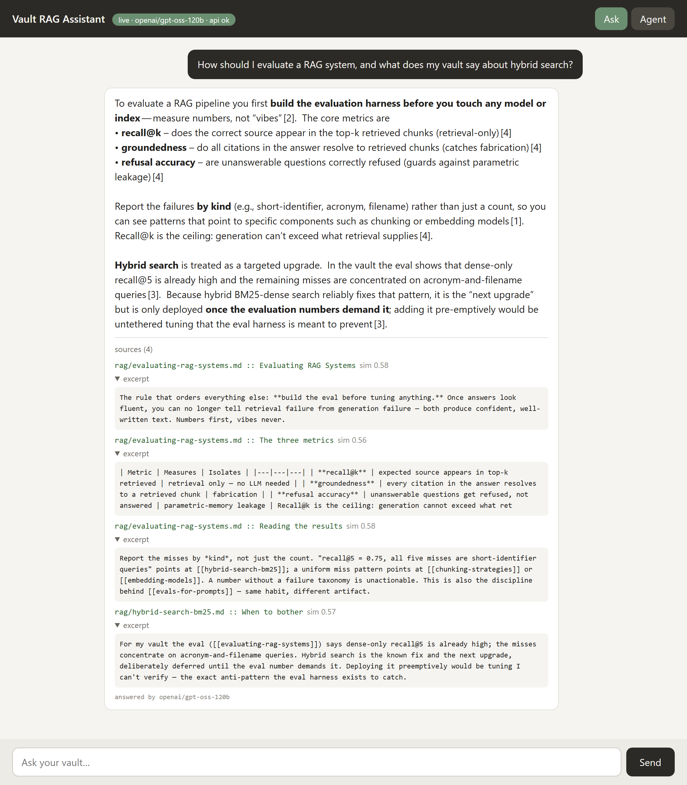
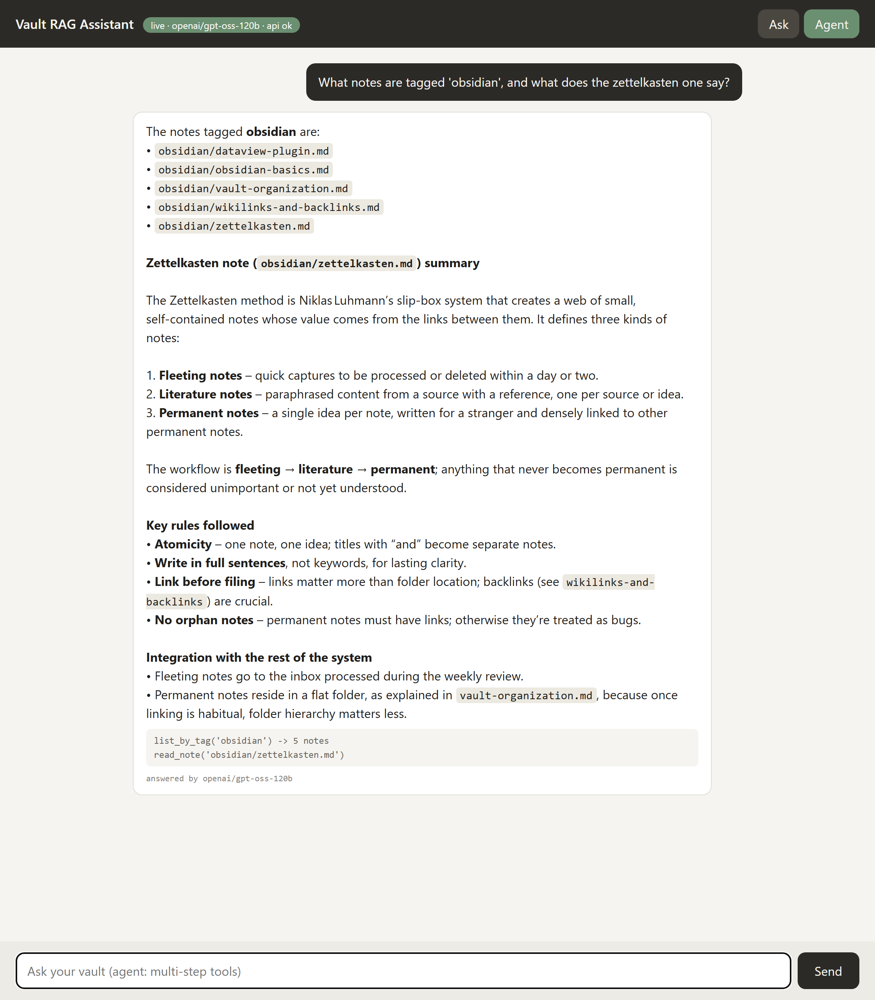

# Obsidian Vault RAG Knowledge Assistant

Ask questions in natural language; get answers grounded in an Obsidian vault,
with citations you can open and verify. Local embeddings, a numpy vector store,
Claude *or* any OpenAI-compatible model for generation, one tool-use loop for
multi-hop questions.

## Quickstart (5 commands)

```bash
python -m venv .venv && .venv/Scripts/activate     # Windows (source .venv/bin/activate on POSIX)
pip install -r requirements.txt
python index.py --vault ./demo_vault               # ~15s: 27 notes -> 108 chunks
cp .env.example .env                               # then set ONE key; skip for extractive mode
python -m uvicorn app:app                          # http://127.0.0.1:8000
```

First model load takes ~1 minute (downloads/loads `all-MiniLM-L6-v2`, then cached).
Point `--vault` at any Obsidian vault — the indexer is safe against hostile
directory shapes (see *Indexer safety* below).

## Architecture

```
vault/*.md
  -> index.py: walk (deny-list) -> dedup (content hash) -> chunk (heading-aware,
                180 words / 30 overlap, token-budget splitter) -> MiniLM embed
                -> vectors.npz + chunks.jsonl + meta.json
  -> app.py (FastAPI):
      POST /ask     cosine top-5 (numpy matmul) -> LLM -> answer + resolved citations
                    top score < 0.27 -> "not in this vault" (no LLM call)
      POST /agent   tool loop (max 8 turns): search_vault / read_note / list_by_tag
      GET  /healthz index stats + provider/model auth probe
      GET  /        chat UI (single static/index.html)
```

## Providers

One key, either kind. Anthropic wins if both are set; with neither the app runs
in **extractive** mode (top chunks verbatim, clearly labelled — `/agent` returns
503 because a model has to drive the tools).

| | `MY_ANTHROPIC_KEY` | `LLM_API_KEY` (OpenAI-compatible) |
|---|---|---|
| Endpoint | pinned `api.anthropic.com` | `LLM_BASE_URL` — OpenRouter, NVIDIA Build, vLLM, LM Studio |
| Citations | **native**: document blocks come back with citation objects, so a cited source *cannot* be invented | reconstructed: chunks are numbered in the prompt, `[n]` markers parsed back, out-of-range markers dropped |
| Models | `claude-opus-5` | `LLM_MODELS` — comma-separated fallback chain |

The fallback chain is not decoration. Measured on free tiers 2026-09-02, three
distinct ways a **HTTP 200** comes back unusable, each of which advances the chain:

- `finish_reason == "length"` — a reasoning model spends the whole budget
  thinking; the reply is cut mid-thought and its `[n]` markers point at sources
  it was only *considering* (this produced a confident `cited=5/5` on garbage
  before it was caught). `max_tokens=4000` plus this check fixed it;
  `reasoning: {"exclude": true}` alone did **not**.
- empty `content` — same cause, budget fully consumed.
- control-token artifacts — `liquid/lfm-2.5` emits a literal
  `<|tool_call_start|>[read(path='/home/gibbon/synthtraces/…')]`, paths out of
  its training data, when handed documents inline. It drives *real* tools
  correctly, so it stays in the chain, last.

Plus ordinary 429s: free models rate-limit per-model and unpredictably (verified
`is_free_tier: true`, `usage: 0` — the cap is upstream, not account spend). All
three OpenRouter models 429'd simultaneously at one point during verification;
`/healthz` reported `api: error: RateLimitError` and `/ask` returned 502 naming
the last failure, which is the designed path working under real conditions.

### Verified live (2026-09-02)

Both paths were exercised end-to-end through the running app, not just to the
request-construction level:

| Provider / model | `/ask` latency | Result |
|---|---|---|
| OpenRouter `nvidia/nemotron-3.5-lightning:free` | 23–52 s | grounded answers, citations resolving to the correct notes, two-hop agent run |
| NVIDIA Build `openai/gpt-oss-120b` | 6–37 s | same, and `list_by_tag('obsidian') -> read_note('obsidian/zettelkasten.md')` -> correct synthesis |

NVIDIA Build is materially faster on a separate quota; OpenRouter free is the
zero-signup default. Retrieval is untouched by either — `eval.py` returns the
identical 0.960 / 1.000 / 0.000 after the provider work.

One bug this only surfaced live: NVIDIA's `gpt-oss-120b` cites with **fullwidth**
brackets (`【1】`, U+3010/U+3011), so the original ASCII-only `\[(\d+)\]` pattern
silently resolved *every* citation to nothing — an answer that looked cited but
listed no sources. Fixed and covered by two checks in `test_citations.py`.

## Evaluation (the number this repo is built around)

`evalset.jsonl` holds 25 hand-written questions written *by reading the notes*
(never model-generated) plus 5 deliberately unanswerable ones.
`python eval.py` measures retrieval — no API key needed:

```
recall@5: 0.960 (24/25)
refusal accuracy @threshold 0.27: 1.000 (5/5)
false-refusal on answerable @threshold 0.27: 0.000 (0/25)
answerable top-score distribution:   min=0.308 median=0.551 max=0.790
unanswerable top-score distribution: min=0.072 median=0.111 max=0.199
```

The refusal threshold (0.27) sits inside the measured gap between unanswerable
(max 0.199) and answerable (min 0.308) top-hit scores.

The one recall miss is a "which decisions were made" query — a decisions-log
note whose *body* doesn't semantically resemble the question. The known fix is
hybrid BM25 + dense fusion with reciprocal rank fusion; deliberately not built
because one miss doesn't justify the dependency. `eval.py` exits non-zero below
recall 0.85 / refusal 0.80, so a regression can't slip through silently.

An earlier body-only embedding scored **recall@5 = 0.840**; prepending the note
title + heading to each chunk's embedded text lifted it to 0.960. That change
was made *because* the eval demanded it — the harness exists to order decisions
like that, not to decorate a README.

`python test_citations.py` covers the grounding boundary that the live API
cannot be made to exercise on demand: 9 checks stubbing the model to emit
invented `[9]` / `[0]` / `[999]` markers (must yield **no** source, never a
wrong one), fullwidth and mixed bracket styles, uncited answers, and the
fallback chain walking all four failure modes above in one pass.

Groundedness in Anthropic live mode is enforced by construction: sources are
extracted from the API's citation objects, which can only reference document
blocks that were sent. On the OpenAI-compatible path it is enforced by bounds
check instead — a marker outside `1..len(hits)` is dropped.

## Design decisions

| Decision | Reason |
|---|---|
| Local MiniLM embeddings, not a hosted API | Anthropic has no embeddings endpoint; its partner (Voyage AI) is a separate account and bill. MiniLM is free, offline, and 384-dim vectors are sufficient at vault scale. |
| Numpy array, not a vector DB | 108 chunks × 384 dims ≈ 166 KB here; even 3,400 chunks (the full real vault this was tested against) is 5 MB. Brute-force cosine is one exact, sub-millisecond matmul. FAISS/Chroma solve a scale problem this doesn't have. |
| Native citations where available, `[n]` parse-back where not | The Anthropic API rejects `citations` + `output_config.format` together, and OpenAI-compatible endpoints have no citation feature at all. Grounding is the product, so each provider uses its strongest available mechanism rather than the lowest common denominator. |
| A model *chain*, not a model | Free-tier endpoints fail three ways at HTTP 200 (above) plus 429. One list and one `_unusable` check make them dependable; per-provider special-casing would not be smaller. |
| `MY_ANTHROPIC_KEY`, base_url pinned | An ambient `ANTHROPIC_BASE_URL` can silently reroute `anthropic.Anthropic()` through a third-party proxy. A distinct env var name plus explicit `base_url="https://api.anthropic.com"` makes that impossible. |
| Refusal threshold at retrieval, not in the model | Below-threshold queries never reach the LLM. Measurable (evalset distributions above), unlike "the model felt the context was insufficient." |
| One tool loop, three tools, one `run_named` | search / read / list-by-tag covers two-hop questions. Both provider loops execute tools through a single function, so the path-escape guard cannot be bypassed by adding a provider. |
| 6-line stdlib `.env` loader, not python-dotenv | `setdefault`, so an explicitly exported variable still wins. Not worth a dependency. |
| thinking: adaptive, no budget_tokens | `budget_tokens` is rejected with 400 on current models. |

## Indexer safety (verified against a messy real vault)

- **Dot-directories are skipped** — tested against a vault whose `find` reports
  858 `.md` files where 680 of them live in `.config-primary`/`.config-secondary`
  plugin caches: zero leaked into the index.
- **Content-hash dedup** — 7 exact duplicate files in that vault were skipped.
  Near-duplicates (a "Copy" folder) are *not* collapsed; exact-hash only.
- **Token budget enforced loudly** — MiniLM silently truncates input past 256
  wordpiece tokens. Chunks are split until `prefix + body` fits, and a final
  assert crashes the indexer rather than truncating. 180 words of prose is
  ~240 tokens, but 180 words of code can exceed 256 — the splitter handles both.
- **Offline-first model load** — `sentence-transformers` HEADs huggingface.co on
  every load even when cached, and dies without network. When the model is
  cached, `HF_HUB_OFFLINE=1` is set before import; a fresh install still
  downloads.

## Tool-call security

`read_note(path)` is model-driven file access — a trust boundary. Paths are
resolved and rejected unless they stay inside the indexed vault
(`../../` escapes, absolute paths, and non-note files all fail loudly).
Verified: five traversal attempts, all blocked. Re-verified on the
OpenAI-compatible loop after it was added, including an agent instructed to read
`../.env` (the file holding the live API key) and an absolute Windows path —
both returned `error: path escapes vault: …` with no content leaked.

The UI is the other direction of the same boundary: answers are markdown, and
the model's text is untrusted, so `mdHtml()` HTML-escapes **first** and only then
applies five inline rules (bold, inline code, bullets, fullwidth citations).
Verified in-browser against `<script>` and `` payloads: escaped,
not executed.

## Limitations

- Dense retrieval only. Exact-identifier queries ("r45", "nc.py") underperform;
  hybrid BM25 fusion is the known, documented next step.
- `/agent`'s loop is bounded at 8 turns; genuinely multi-hop research questions
  can exhaust it.
- Extractive mode is a fallback for demos, not a product: it returns verbatim
  chunks, it does not answer.
- The eval set is 30 questions on a 27-note demo corpus — enough to order
  engineering decisions, not a benchmark.
- Live answers are verified **by hand**, not scored: grounded answers with
  correct citations, out-of-scope refusal, and two-hop agent runs were confirmed
  on both providers, but the full 30-question evalset has not been pushed
  through `/ask` and scored for groundedness. That is the remaining measurement,
  and it needs a paid tier — free-model 429s make a 30-question sweep flaky.
- Free-model prose quality is visibly below Claude's. The pipeline is the
  deliverable; the generator is a swappable env var.

## Screenshots

**Ask mode** — the answer, then every retrieved chunk expanded. Each `[n]` in the
text resolves to one of the sources listed below it; the footer names the model
that actually answered, which the fallback chain makes variable.



**Agent mode** — same UI, tool loop instead of one-shot retrieval. The trace at
the bottom is the two-hop run the model chose on its own:
`list_by_tag('obsidian') -> 5 notes`, then `read_note('obsidian/zettelkasten.md')`.



Both captured against NVIDIA Build (`openai/gpt-oss-120b`) because OpenRouter's
free tier was rate-limited at capture time — the 429 behaviour described above,
in practice.

## Files

```
index.py            indexer: walk / dedup / chunk / embed -> vectors/
rag.py              VaultIndex: load, cosine search, guarded reads, tag lookup, model loader
app.py              FastAPI: /ask /agent /healthz / (+ static), both provider paths
eval.py             recall@5, refusal accuracy, false-refusal rate, score distributions
test_citations.py   9 checks: citation bounds, bracket styles, fallback chain
evalset.jsonl       25 answerable + 5 unanswerable questions
demo_vault/         sanitized 27-note Obsidian corpus (frontmatter, tags, wikilinks)
static/             the entire UI, one HTML file
docs/               README screenshots
.env.example        both provider options, commented
```
